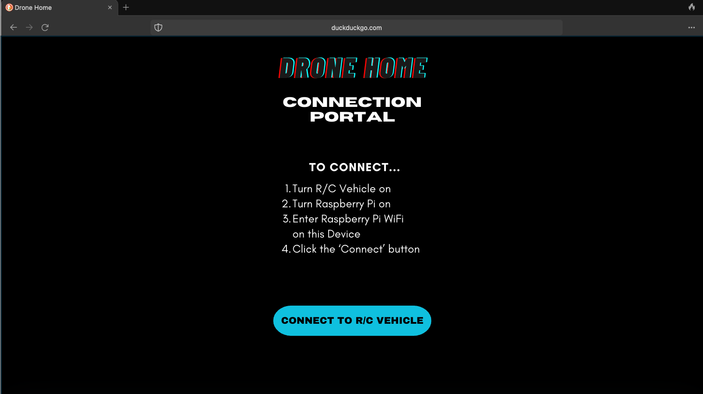

To use application:

1. In this dir, run 'python3 app.py'

2. Click on website

To edit application:

1. Open new Terminal in same dir

2. Run 'idle3' & open Python files and edit project

3. Else, run VS to modify other files

To push changes:

1. Stage changes with 'git add'

2. Commit changes to local copy with 'git commit'

3. Push changes to Github Master Version with 'git push'

BlueSky Design:

Connection Portal:

Controller Page:

