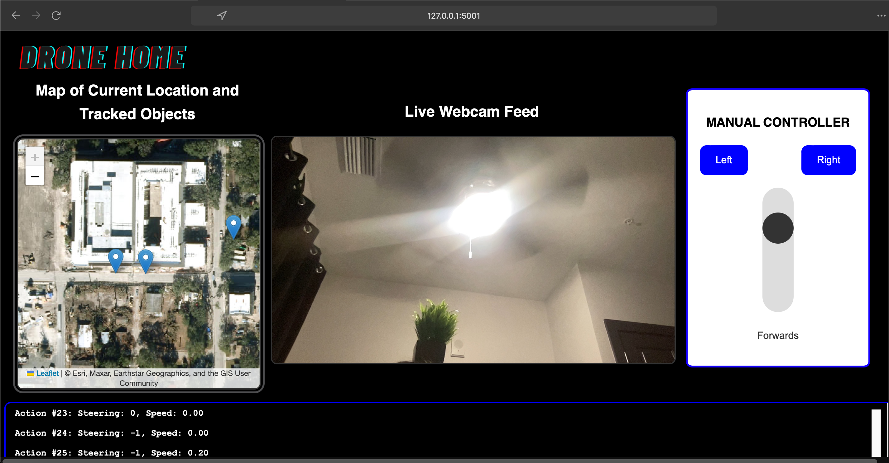
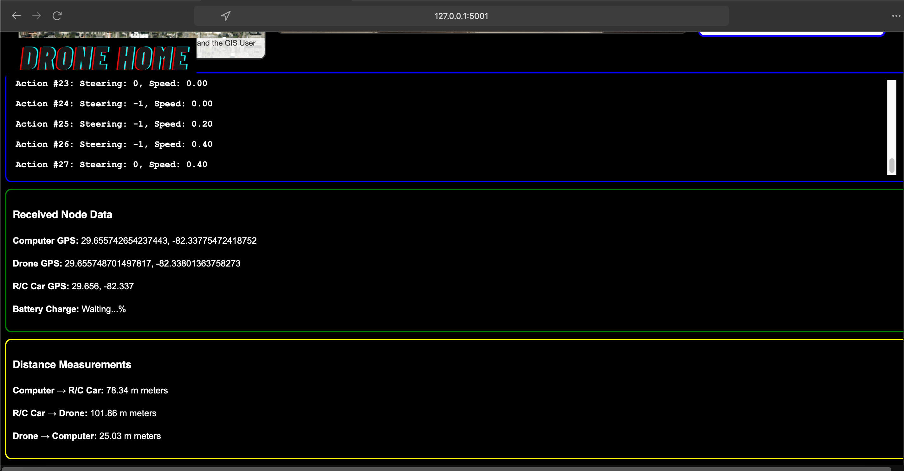
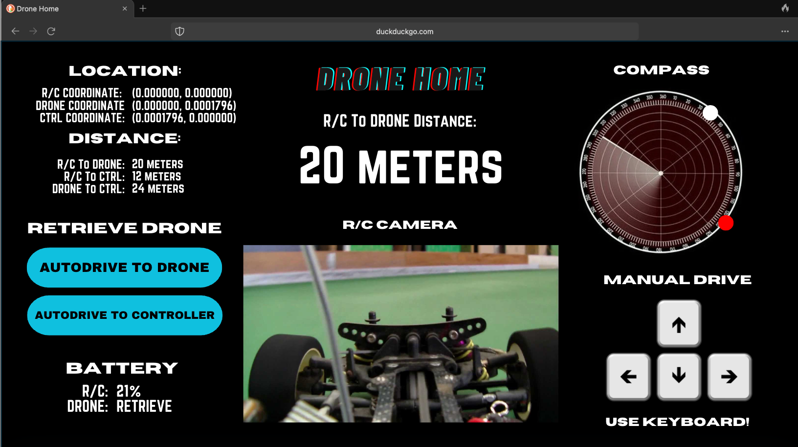

To use application:

1. In the RCFLASK dir, run 'python3 app.py'

2. Click on website

[To edit application, use VS Code, preferably.]

Current Display:

BlueSky Design:

To set Location Permissions, go to the directory and in the terminal run:

openssl req -x509 -newkey rsa:4096 -keyout key.pem -out cert.pem -days 365 -nodes

Then enter: US Florida Gainesville - - 127.0.0.1 -
